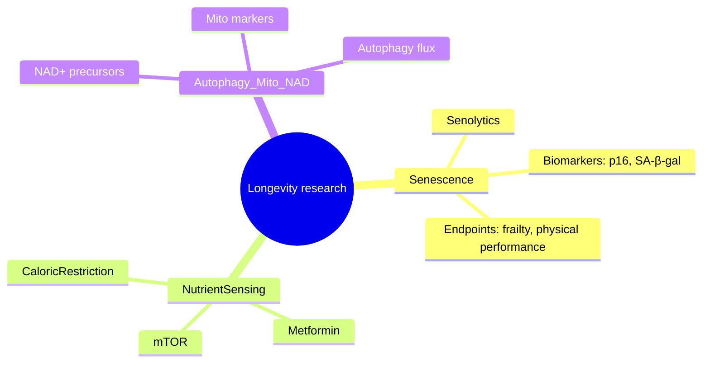

# C2S-Scale Medical Research Lab — reproducible LLM experiments for biomedical research

A lightweight, reproducible toolkit for running and evaluating LLM-assisted workflows in biomedical research. This repository contains data-collection pipelines, evidence-extraction code, LLM synthesis helpers, and evaluation utilities designed to be auditable and runnable via virtualenv or Docker.

## Goal
- This repository represents the "C2S-Scale Medical Research Lab": a reproducible, auditable set of experiments, tools, and CI for using large language models (LLMs) safely in biomedical research. It focuses on running and evaluating c2s-scale (Gemma) and compatible LLMs via Hugging Face, Ollama, or local Transformers.
- Provide clear, reproducible environment setup (venv, Docker), usage examples, and embedding-based evaluation pipelines while respecting model licensing and safety constraints.

## Quick checklist
- [x] Analyze requirements and create docs
- [ ] Add example script (example.py)
- [ ] Add setup scripts (scripts/setup.sh, scripts/setup.ps1)
- [ ] Add Dockerfile and docker-compose example
- [ ] Add CI workflow for reproducible tests
- [ ] Verify end-to-end run locally
- [ ] Publish reproduction steps in a single script

## Longevity mindmap (example)

<!-- Longevity mindmap (Mermaid) -->


### Note on rendering and use
- This diagram is a Mermaid mindmap. Some Markdown viewers (GitHub, VS Code Markdown Preview, GitLab) render Mermaid diagrams natively; others may show the raw text. If consistent rendering is required across all viewers, consider adding a fallback image (e.g., experiments/figures/longevity_mindmap.svg) and embedding it with: ``.
- The diagram is illustrative only and intended to showcase what this project can help produce. It is not a literature review or medical guidance. See the "Safety / disclaimers" section later in this README for full guidance on verification, provenance, and expert curation.

Reproducible installation (recommended)

1) Clone repo
```bash
git clone https://github.com/stancsz/c2s-scale-longevity-experiment.git
cd c2s-scale-longevity-experiment
```

2) Python virtualenv + pip (recommended)
```bash
# Unix / WSL / Git Bash
python -m venv .venv
source .venv/bin/activate
pip install --upgrade pip
# install from PyPI if available
pip install c2s-scale
# OR if you have source in this repo:
# pip install -e .
```

Windows (PowerShell)
```powershell
python -m venv .venv
.\.venv\Scripts\Activate.ps1
python -m pip install --upgrade pip
pip install c2s-scale
```

3) Example usage (CLI)

If you installed the package from PyPI or have the repo on your PATH this may be available as a top-level CLI named `c2s-scale`. The repo also contains a portable, source-first CLI you can run with Python:

```bash
# If the package is installed and exposes a console script:
c2s-scale --help
c2s-scale run --config path/to/config.yaml

# Or run the included CLI directly from source:
python -m c2s_scale.cli --help
python -m c2s_scale.cli chat                # interactive REPL
python -m c2s_scale.cli send "Hello"       # send a single message and exit
python -m c2s_scale.cli run --config path/to/config.yaml
```

Behavior notes:
- If OPENAI_API_KEY is present in your environment the CLI will use OpenAI's chat completions endpoint (default model: `gpt-3.5-turbo`). Set `--model` or `-m` to change models.
- If no API key is set, the CLI falls back to a deterministic local stub reply (safe, offline).
- The interactive REPL supports quick commands:
  - `/exit` — exit REPL
  - `/help` — show help
  - `/history` — show message history
  - `/model <name>` — change model for subsequent requests
  - `/clear` — clear conversation history

4) Example usage (Python)
```python
# python
# NOTE: adjust the import/API to match the package's real API
from c2s_scale import Client

client = Client()          # instantiate client (example)
result = client.run("experiment-config.yaml")
print(result)
```

Docker (fully reproducible)
- Docker isolates system-level differences. Example Dockerfile:
```dockerfile
FROM python:3.11-slim
WORKDIR /app
COPY requirements.txt .
RUN pip install --no-cache-dir -r requirements.txt
COPY . .
CMD ["python", "example.py"]
```
Example build & run:
```bash
docker build -t c2s-scale-example:latest .
docker run --rm c2s-scale-example:latest
```

Suggested requirements.txt
```text
c2s-scale
# add any other pinned deps here, e.g.
# pyyaml==6.0
```

Suggested project files to add (next steps)
- example.py — small reproducible script demonstrating a typical experiment
- scripts/setup.sh and scripts/setup.ps1 — one-shot setup scripts that create venv and install pinned deps
- Dockerfile — as above
- .github/workflows/ci.yml — test matrix (python versions) that installs pinned deps and runs example.py

Minimal CI snippet (GitHub Actions)
```yaml
name: CI
on: [push, pull_request]
jobs:
  test:
    runs-on: ubuntu-latest
    strategy:
      matrix:
        python: [3.10, 3.11]
    steps:
      - uses: actions/checkout@v4
      - name: Set up Python
        uses: actions/setup-python@v4
        with:
          python-version: ${{ matrix.python }}
      - name: Install deps
        run: |
          python -m venv .venv
          source .venv/bin/activate
          pip install -U pip
          pip install -r requirements.txt
      - name: Run example
        run: |
          source .venv/bin/activate
          python example.py
```

Notes and tips
- Pin versions in requirements.txt for reproducibility.
- If c2s-scale is not on PyPI, include a submodule or install from git URL:
```bash
pip install git+https://github.com/<owner>/c2s-scale.git@<commit-or-tag>
```
- Prefer Docker for collaborators who don't want to configure environments.
- Add small example.py (<=30 lines) that demonstrates the minimal API and can be run by CI.

Next action (completed / next steps)
- Added example.py, requirements.txt, Dockerfile, scripts/setup.sh, scripts/setup.ps1, run_experiment.py, experiments/, experiments/eval_embeddings.py, and a CI workflow.
- Quick test (Unix):
  ```bash
  bash scripts/setup.sh
  source .venv/bin/activate
  export HF_TOKEN="hf_xxx"   # set your Hugging Face token
  python run_experiment.py --mode hf --model vandijklab/C2S-Scale-Gemma-2-27B --prompt-file experiments/example_prompt.txt
  ```
- To run via Ollama (if you host/import the model locally): install Ollama, import or convert the model to a format Ollama accepts, then:
  ```bash
  ollama run <model-name> --prompt "$(cat experiments/example_prompt.txt)"
  ```
- Add an Ollama import/conversion helper and an evaluation runner that saves outputs to `experiments/outputs/` for embedding-based analysis.

LLM research example: factors affecting cell aging and longevity
- Goal: demonstrate using an LLM to gather and summarize high-level, peer-reviewed concepts about cellular aging to inform experiments and documentation. The summary below is an LLM-style synthesis suitable for README-level references; always verify details against primary literature before experimental use.

Summary
- Cellular aging (senescence) and organismal longevity are multifactorial processes influenced by genetic, molecular, cellular, and environmental factors. Key, well-supported mechanisms include genomic instability and DNA damage accumulation, telomere shortening, epigenetic alterations, mitochondrial dysfunction, loss of proteostasis, cellular senescence, stem cell exhaustion, deregulated nutrient sensing (e.g., insulin/IGF-1, mTOR, AMPK), impaired autophagy, chronic inflammation (inflammaging), and extracellular matrix/microenvironmental changes. Lifestyle and environmental inputs (diet, exercise, toxins, microbiome) modulate many of these pathways.

Key factors (concise)
- Genomic instability and DNA damage: accumulation of mutations and impaired repair raises mutation burden and dysfunction.
- Telomere attrition: progressive shortening of telomeres limits replicative capacity and can trigger senescence.
- Epigenetic alterations: age-related changes in DNA methylation, histone marks, and chromatin organization alter gene expression programs.
- Mitochondrial dysfunction and ROS: reduced mitochondrial efficiency and increased reactive oxygen species affect energy homeostasis and damage macromolecules.
- Proteostasis loss: impaired protein folding, clearance (ubiquitin-proteasome, autophagy) leads to protein aggregation and dysfunction.
- Cellular senescence: stable cell-cycle arrest with a pro-inflammatory SASP (senescence-associated secretory phenotype) that affects tissue function.
- Stem cell exhaustion: decline in regenerative capacity due to intrinsic and extrinsic factors.
- Nutrient sensing and metabolic pathways: insulin/IGF-1 signaling, mTOR, AMPK, and sirtuins regulate lifespan in model organisms.
- Autophagy and lysosomal function: critical for clearing damaged organelles and maintaining cellular health.
- Chronic inflammation (inflammaging): low-grade systemic inflammation that exacerbates tissue decline.
- Microenvironment and ECM remodeling: altered extracellular matrix can impair cell function and signaling.
- Environmental/lifestyle modulators: diet, caloric restriction / intermittent fasting effects, exercise, sleep, exposure to toxins, and the microbiome.

Example LLM prompt (use with your preferred model)
```text
Research assistant: Summarize the major molecular and cellular factors that drive cellular aging and affect organismal longevity. For each factor, provide a one-sentence description, two representative primary-review citations (author, year, journal), and a short note on experimental interventions or biomarkers commonly used. Keep the response concise and provide references suitable for follow-up literature review.
```

Example expected LLM output (short excerpt)
- Telomere attrition — Telomere shortening limits replicative capacity and can trigger senescence; biomarkers: telomere length (qPCR, TRF); interventions: telomerase activation in model systems. (Lopez-Otín et al., 2013, Cell; Shay & Wright, 2019, Nat Rev Cancer)
- Mitochondrial dysfunction — Age-related decline in mitochondrial function reduces ATP production and increases ROS; biomarkers: mitochondrial membrane potential, mtDNA damage; interventions: mitochondria-targeted antioxidants, exercise. (Lopez-Otín et al., 2013, Cell; Sun et al., 2016, Nat Rev Mol Cell Biol)

Suggested follow-ups
- Run the prompt against a well-curated LLM (local or hosted) and capture outputs into experiments/outputs/*.json for later embedding-based analysis (see experiments/eval_embeddings.py).
- Cross-check LLM-provided citations against PubMed/Google Scholar and add canonical DOI/URLs in RESEARCH.md or _reference/.
- Use the summary to seed specific experiment prompts (e.g., "Design an experiment to measure autophagy flux changes with age in primary human fibroblasts") and validate with domain experts.

References (starter)
- Lopez-Otín C., Blasco M.A., Partridge L., Serrano M., Kroemer G. (2013). The hallmarks of aging. Cell.
- Kirkwood T.B.L. (2005). Understanding the odd science of aging. Cell.
- Campisi J. (2013). Aging, Cellular Senescence, and Cancer. Annu Rev Physiol.

(Replace or expand the above references with DOIs and more targeted citations after running an LLM-assisted literature pass.)

---

## Longevity research — existing work in this repository (summary)

This repository already includes a focused set of reproducible tools and example outputs useful for early-stage longevity evidence synthesis and LLM-assisted literature workflows:

- Data collection pipelines
  - experiments/collect_trials.py — ClinicalTrials.gov metadata fetcher (example runs saved under experiments/outputs/)
  - experiments/collect_pubmed.py — PubMed esearch + efetch helper (sample pipeline present; can be scaled)
- Evidence extraction & normalization
  - experiments/extract_evidence.py — heuristic extractor that produces structured JSON (experiments/outputs/structured_evidence.json)
  - Current structured evidence (snapshot): 2 ClinicalTrials.gov items (pilot biomarker trial and an observational cohort)
- Synthesis & reporting
  - experiments/generate_llm_summary.py and experiments/generate_report.py — produce model-draft syntheses and render final_report.md via templates (experiments/report_template.md)
  - experiments/outputs/final_report.md — template-driven report with provenance and safety disclaimers
- Evaluation & embeddings
  - experiments/eval_embeddings.py — scripts and patterns for embedding-based similarity and clustering analyses
- Reproducibility & automation
  - scripts/setup.sh, scripts/setup.ps1, Dockerfile, and a CI workflow (.github/workflows/ci.yml) to standardize environment and runs
- Provenance & safety
  - Outputs include generated timestamps, input counts, and explicit safety disclaimers (reports are non-clinical and require human verification)

Current evidence snapshot (from experiments/outputs/structured_evidence.json)
- 2 entries from ClinicalTrials.gov (one interventional Phase 2 pilot with Placebo, one observational cohort active/not recruiting)
- No PubMed abstracts collected in current snapshot
- Top intervention (automatically extracted): placebo (1)

Implication: the repo demonstrates the end-to-end plumbing (fetch → extract → synthesize → evaluate) but currently contains a small sample dataset. The tooling is in place to scale data collection, normalization, and downstream LLM-assisted synthesis.

## Top 3 areas to investigate (recommended, literature-aligned)

These three areas are high-priority targets for further evidence collection and automated synthesis, with strong literature support and measurable outcomes:

1. Cellular senescence & senolytics
   - Why: senescent cells drive local inflammation (SASP) and tissue dysfunction; senolytic interventions show promising preclinical and early clinical signals.
   - What to collect: clinical trials of senolytic drugs (e.g., dasatinib+quercetin), biomarkers of senescence (p16INK4a, SA-β-gal), functional endpoints (physical performance, frailty indices).
2. Nutrient-sensing & metabolic interventions (mTOR, AMPK, metformin, rapamycin, caloric restriction)
   - Why: conserved pathways with replicated lifespan effects in models and several translational clinical trials and observational studies.
   - What to collect: randomized trials and cohort studies measuring metabolic biomarkers, immune markers, and clinical endpoints; preclinical meta-analyses.
3. Autophagy / mitochondrial function & NAD+ metabolism
   - Why: autophagy and mitochondrial health are central to proteostasis and cellular energetics; interventions (NAD+ precursors, exercise, mito-targeted therapies) have measurable biomarkers.
   - What to collect: trials measuring autophagy flux, mitochondrial markers (mtDNA damage, membrane potential), functional readouts.

Note: these areas overlap with the canonical "hallmarks of aging" and are practical to target with the current repo tooling.

## Concrete next steps (actionable, repo-focused)

1. Scale data collection
   - Run broader queries for trials and PubMed to build a larger evidence corpus. Example:
     ```bash
     python experiments/collect_trials.py --query "senolytic OR senolytics OR senescence" --max 500 --out experiments/outputs/trials_senolytic.json
     python experiments/collect_pubmed.py --query "senolytic trials OR senolytic clinical trial" --max 1000 --out experiments/outputs/pubmed_senolytic.json
     ```
   - Weekly scheduled pulls via CI (GitHub Actions) to keep corpus current.

2. Improve extraction & normalization
   - Enhance experiments/extract_evidence.py to:
     - extract outcome measures and timepoints
     - normalize interventions and conditions (use MeSH / UMLS / NCIt mappings)
     - map trial status to standardized categories
   - Add unit tests for extractor edge cases.

3. Add citation verification and linking
   - Cross-link PMIDs/DOIs/NCT IDs and add automated verification step (fetch metadata) to reduce hallucinated citations in LLM summaries.

4. Expand evaluation & model benchmarking
   - Use experiments/eval_embeddings.py to compare embeddings models and clustering parameters; record reproducible configs and metrics.
   - Run LLM comparisons (local and hosted) using experiments/generate_llm_summary.py with identical prompts and temperature settings; save outputs for diffing.

5. Build human-in-the-loop curation flow
   - Export extracted evidence to CSV/Markdown for domain expert review.
   - Add a simple review script that shows evidence items and allows accept/reject/notes, producing a curated JSON for final reporting.

6. Add quantitative synthesis capabilities
   - Where possible, aggregate effect-size metrics (mean differences, hazard ratios) or at minimum count evidence strength (trial phase, sample size, status).
   - Implement a "strength-of-evidence" heuristic in extract_evidence.py (e.g., RCTs > cohorts > case reports).

7. Improve reproducibility and CI
   - Add a scheduled GitHub Action to run key pipelines (fetch → extract → synthesize) and save outputs as artifacts.
   - Add a small example.py that demonstrates an end-to-end run with a single query to be used by CI and contributors.

8. Documentation & provenance
   - Expand RESEARCH.md and _reference/references.md with verified primary sources (DOIs/PMIDs) that the LLM outputs reference.
   - Document curation guidelines and safe-use policies (already present in templates, but expand with explicit provenance checks required before publication).

## Safety / disclaimers
- All outputs produced by LLMs and automated extractors are draft-level and informational only. This repository explicitly avoids producing clinical recommendations. Any translation to practice requires domain expert review, verification of identifiers (NCT, DOI, PMID), and appropriate ethical oversight.

---

If you want, I can now:
- run targeted collection commands for one of the top areas (senolytics, mTOR/metformin, or autophagy/NAD+) to populate experiments/outputs/, or
- open and propose a small replace_in_file patch to add a short "Longevity research" README sidebar instead of the full-file overwrite above.
